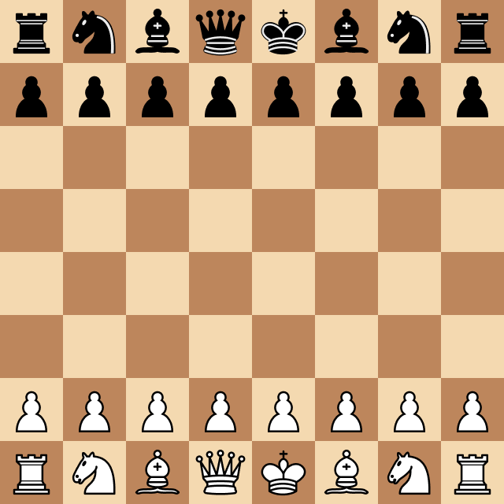

# Simple_ChessAI
 Chess AI Bot based on Convolutional neural networks. 
The relative strength can be estimated as a rating of 600 on chess.com.

Example of game: \
White - Simple_ChessAI \
Black - Chess.com 550 engine

